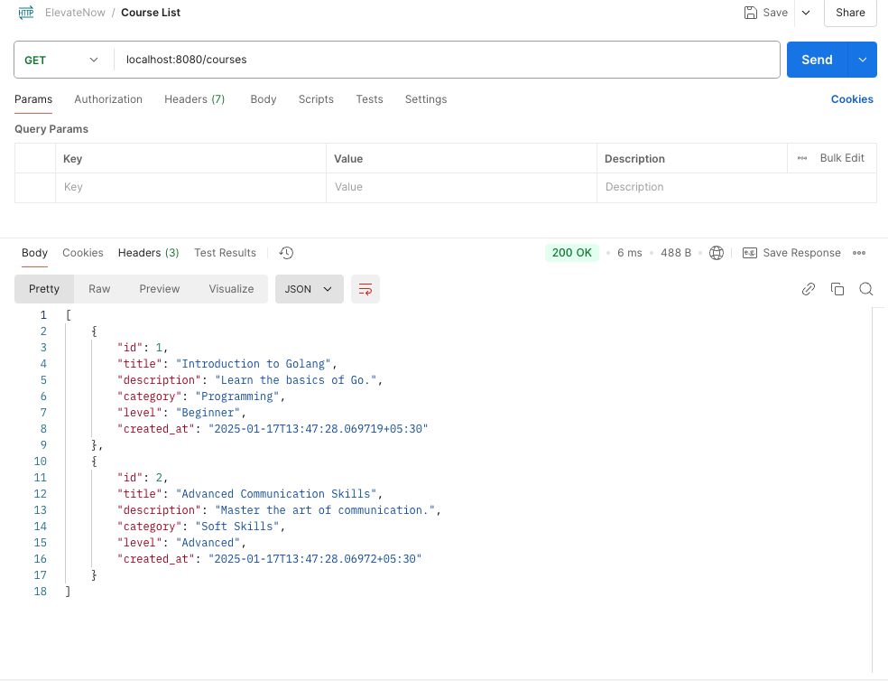

### **1. Create a Course**
**API Endpoint**: `/courses`  
**Method**: `POST`  
**Content-Type**: `application/json`

#### **Request Body:**
```json
{
  "title": "Introduction to Golang",
  "description": "Learn the basics of the Go programming language",
  "instructor": "John Doe"
}
```

#### **Expected Response:**
- **Success (201 Created)**:
```json
{
  "message": "Course created successfully",
  "course": {
    "id": 1,
    "title": "Introduction to Golang",
    "description": "Learn the basics of the Go programming language",
    "instructor": "John Doe",
    "created_at": "2025-01-01T12:00:00Z"
  }
}
```
- **Failure (400 Bad Request)** (if validation fails):
```json
{
  "error": "Validation error message"
}
```

---

### **2. Get All Courses**
**API Endpoint**: `/courses`  
**Method**: `GET`  
**Content-Type**: `application/json`

#### **Expected Response:**
- **Success (200 OK)**:
```json
[
  {
    "id": 1,
    "title": "Introduction to Golang",
    "description": "Learn the basics of the Go programming language",
    "instructor": "John Doe",
    "created_at": "2025-01-01T12:00:00Z"
  },
  {
    "id": 2,
    "title": "Advanced Python Programming",
    "description": "Master advanced topics in Python programming",
    "instructor": "Jane Smith",
    "created_at": "2025-01-05T15:00:00Z"
  }
]
```

### **Postman: GetCourses**


---

### **3. Get a Specific Course**
**API Endpoint**: `/courses/:id`  
**Method**: `GET`  
**Content-Type**: `application/json`

#### **Path Parameter:**
- `id`: The course ID to fetch details (e.g., `/courses/1`).

#### **Expected Response:**
- **Success (200 OK)**:
```json
{
  "id": 1,
  "title": "Introduction to Golang",
  "description": "Learn the basics of the Go programming language",
  "instructor": "John Doe",
  "created_at": "2025-01-01T12:00:00Z"
}
```
- **Failure (404 Not Found)**:
```json
{
  "error": "Course not found"
}
```

---

### **4. Update a Course**
**API Endpoint**: `/courses/:id`  
**Method**: `PUT`  
**Content-Type**: `application/json`

#### **Path Parameter:**
- `id`: The course ID to update (e.g., `/courses/1`).

#### **Request Body:**
```json
{
  "title": "Introduction to Golang - Updated",
  "description": "Updated description of the Go programming course",
  "instructor": "John Doe"
}
```

#### **Expected Response:**
- **Success (200 OK)**:
```json
{
  "message": "Course updated successfully",
  "course": {
    "id": 1,
    "title": "Introduction to Golang - Updated",
    "description": "Updated description of the Go programming course",
    "instructor": "John Doe",
    "updated_at": "2025-01-10T12:00:00Z"
  }
}
```
- **Failure (404 Not Found)**:
```json
{
  "error": "Course not found"
}
```

---

### **5. Delete a Course**
**API Endpoint**: `/courses/:id`  
**Method**: `DELETE`  
**Content-Type**: `application/json`

#### **Path Parameter:**
- `id`: The course ID to delete (e.g., `/courses/1`).

#### **Expected Response:**
- **Success (200 OK)**:
```json
{
  "message": "Course deleted successfully"
}
```
- **Failure (404 Not Found)**:
```json
{
  "error": "Course not found"
}
```
