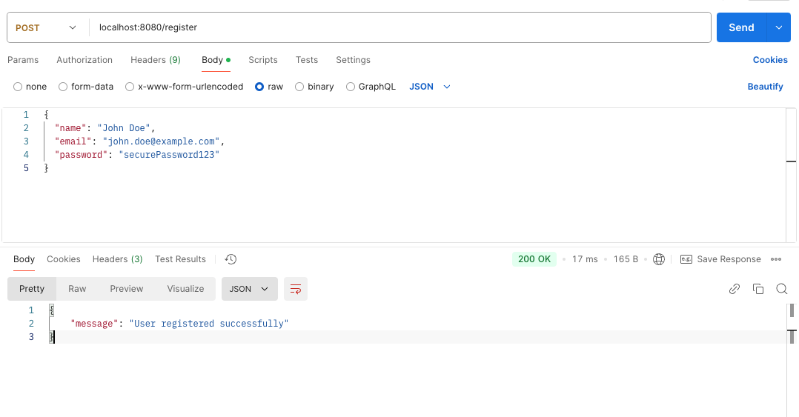

### **1. Register User**
**API Endpoint**: `/register`  
**Method**: `POST`  
**Content-Type**: `application/json`  

#### **Request Body:**
```json
{
  "name": "John Doe",
  "email": "john.doe@example.com",
  "password": "securePassword123"
}
```

#### **Expected Response:**
- **Success (200 OK)**:
```json
{
  "message": "User registered successfully"
}
```
- **Failure (400 Bad Request)** (if validation fails):
```json
{
  "error": "Validation error message"
}
```

### **Register Postman**



---

### **2. Get User Details**
*(If implemented in the controller; requires an endpoint like `/user/:id`)*
**API Endpoint**: `/user/:id`  
**Method**: `GET`  
**Content-Type**: `application/json`  

#### **Path Parameter:**
- `id`: User ID to fetch details (e.g., `/user/1`).

#### **Expected Response:**
- **Success (200 OK)**:
```json
{
  "id": 1,
  "name": "John Doe",
  "email": "john.doe@example.com",
  "created_at": "2025-01-01T12:00:00Z"
}
```
- **Failure (404 Not Found)**:
```json
{
  "error": "User not found"
}
```